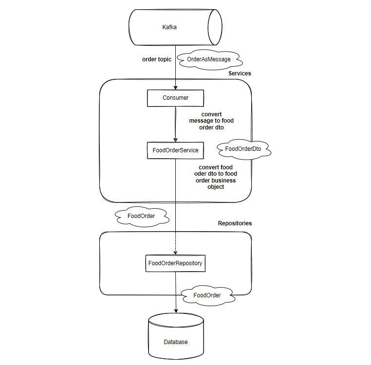

# my_java_kafka_consumer_template
# Template ***Kafka Consumer***
1. [Definitions](#definitions)
   * [Kafka](#kafka)
   * [Topics](#topics)
   * [Sections](#sections)
   * [Templates](#template)
2. [Architecture](#architecture)
3. [Launch to Docker](#launching-in-docker)
4. [Consumer](#consumer)

## Definitions
### Kafka
Kafka cluster has high scalability and fault tolerance:
if one of the nodes breaks down, other nodes take over its work,
ensuring continuity of work without data loss.

Data is read and written to Kafka in the form of events
containing information in various formats, for example, in the form of a string,
array, or JSON object.

**Producer** (producer, publisher) publishes (records) events in Kafka,
and **Consumer** (consumer, subscriber) subscribes to these events and processes them.

### Topics
Events are grouped into topics (topic). A topic looks like a folder, and events look like files in that folder.
A topic can have zero, one, or many publishers and subscribers.

Events can be read as many times as necessary.
This is the difference between Kafka and traditional messaging systems:
after reading, events are not deleted. You can configure how long Kafka stores events.

### Sections
Topics are divided into sections (partition). Publishing an event in a topic actually means
adding it to one of the sections. Events with the same keys are recorded in one section.
Within the section, Kafka guarantees the order of events.


For fault tolerance and high availability, the topic can be replicated,
including between different geographically remote data centers.
That is, there will always be several brokers with copies of the data in case something goes wrong.

### Template


## Architecture


Producer is a microservice ("writer") that receives messages
and transmits them via Kafka to the Consumer microservice ("reader") to save them in the database.

## Launching in Docker

Kafka, Kafdrop and Zookeeper startup parameters in docker

```yaml
version: "3.7"

networks:
  kafka-net:
    name: kafka-net
    driver: bridge

services:
  zookeeper:
    image: zookeeper:3.7.0
    container_name: zookeeper
    restart: "no"
    networks:
      - kafka-net
    ports:
      - "2181:2181"

  kafka:
    image: obsidiandynamics/kafka
    container_name: kafka
    restart: "no"
    networks:
      - kafka-net
    ports:
      - "9092:9092"
    environment:
      KAFKA_LISTENER_SECURITY_PROTOCOL_MAP: DOCKER_INTERNAL:PLAINTEXT,DOCKER_EXTERNAL:PLAINTEXT
      KAFKA_LISTENERS: DOCKER_INTERNAL://:29092,DOCKER_EXTERNAL://:9092
      KAFKA_ADVERTISED_LISTENERS: DOCKER_INTERNAL://kafka:29092,DOCKER_EXTERNAL://${DOCKER_HOST_IP:-127.0.0.1}:9092
      KAFKA_INTER_BROKER_LISTENER_NAME: DOCKER_INTERNAL
      KAFKA_ZOOKEEPER_CONNECT: "zookeeper:2181"
      KAFKA_BROKER_ID: 1
      KAFKA_OFFSETS_TOPIC_REPLICATION_FACTOR: 1
    depends_on:
      - zookeeper

  kafdrop:
    image: obsidiandynamics/kafdrop
    container_name: kafdrop
    restart: "no"
    networks:
      - kafka-net
    ports:
      - "9000:9000"
    environment:
      KAFKA_BROKERCONNECT: "kafka:29092"
    depends_on:
      - "kafka"
```

## Consumer



Stages of creating a Consumer microservice:

* configuring group-id and beans;
* setting up access to the database;
* creating Consumer and OrderService;
* creating an OrderRepository repository.

Configurations of the Consumer microservice and database.

```yaml
server:
  port: 8081

topic:
  name: t.food.order

spring:
  kafka:
    consumer:
      group-id: "default"

  h2:
    console:
      enabled: true
      path: /h2-console
  datasource:
    url: jdbc:h2:mem:testdb
    username: sa
    password: password
```
Config is responsible for configuring the ModelMapper bean, a library for mapping
some objects to others. For example, for the DTO used next.

```java
@Configuration
public class Config {

    @Bean
    public ModelMapper modelMapper() {
        return new ModelMapper();
    }

}
```

Class model:

```java
@Data
@Value
public class OrderDto {
    String item;
    Double amount;
}
```

```java
@Data
@Entity
@NoArgsConstructor
@AllArgsConstructor
public class Order {

    @Id @GeneratedValue(strategy = GenerationType.IDENTITY)
    private Long id;
    private String item;
    private Double amount;
}
```

Consumer is responsible for listening to the topic with orders and receiving messages.
We convert the received messages into an OrderDto that does not contain anything
related to persistence, for example, ID.

```java
@Slf4j
@Component
public class Consumer {

    private static final String orderTopic = "${topic.name}";

    private final ObjectMapper objectMapper;
    private final OrderService orderService;

    @Autowired
    public Consumer(ObjectMapper objectMapper, OrderService orderService) {
        this.objectMapper = objectMapper;
        this.orderService = orderService;
    }

    @KafkaListener(topics = orderTopic)
    public void consumeMessage(String message) throws JsonProcessingException {
        log.info("message consumed {}", message);

        OrderDto orderDto = objectMapper.readValue(message, OrderDto.class);
        orderService.persistOrder(orderDto);
    }

}
```

OrderService — converting the received DTO into an Order object and saving it to the database.

```java
@Slf4j
@Service
public class OrderService {

    private final OrderRepository orderRepository;
    private final ModelMapper modelMapper;

    @Autowired
    public OrderService(OrderRepository orderRepository, ModelMapper modelMapper) {
        this.orderRepository = orderRepository;
        this.modelMapper = modelMapper;
    }

    public void persistOrder(OrderDto orderDto) {
        Order order = modelMapper.map(orderDto, Order.class);
        Order persistedOrder = orderRepository.save(order);

        log.info("order persisted {}", persistedOrder);
    }

}
```

Code OrderRepository:

```java
@Repository
public interface OrderRepository extends JpaRepository<Order, Long> {
}
```
---

Additional files and information are contained in the materials folder at the root of the project
