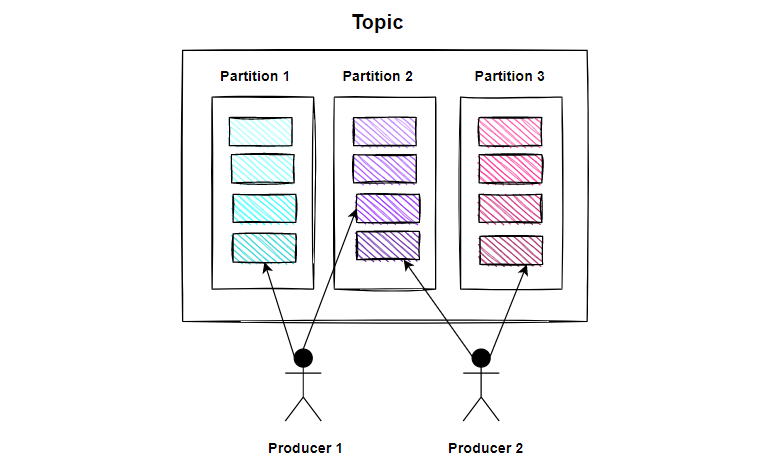

# Шаблон ***Kafka Consumer***
1. [Определения](#определения)
    * [Kafka](#kafka)
    * [Топики](#топики)
    * [Разделы](#разделы)
    * [Templates](#шаблон)
2. [Архитектура](#архитектура)
3. [Запуск в Docker](#запуск-в-docker)
4. [Kafdrop](#kafdrop)
5. [Consumer](#consumer)

## Определения
### Kafka
Кластер Kafka обладает высокой масштабируемостью и отказоустойчивостью:
при поломке одного из узлов, другие узлы берут на себя его работу,
обеспечивая непрерывность работы без потери данных.

Чтение и запись данных в Kafka выполняется в виде событий,
содержащих информацию в различном формате, например, в виде строки,
массива или JSON-объекта.

**Producer** (производитель, издатель) публикует (записывает) события в Kafka,
а **Consumer** (потребитель, подписчик) подписывается на эти события и обрабатывает их.

### Топики
События группируются в топики (topic). Топик похож на папку, а события — на файлы в этой папке. 
У топика может быть ноль, один или много издателей и подписчиков.

События можно прочитать столько раз, сколько необходимо.
В этом отличие Kafka от традиционных систем обмена сообщениями:
после чтения события не удаляются. Можно настроить, как долго Kafka хранит события.

### Разделы
Топики поделены на разделы (partition). Публикация события в топике фактически означает
добавление его к одному из разделов. События с одинаковыми ключами записываются в один раздел.
В рамках раздела Kafka гарантирует порядок событий.

Для отказоустойчивости и высокой доступности топик может быть реплицирован,
в том числе между различными, географически удаленными, датацентрами.
То есть всегда будет несколько брокеров с копиями данных на случай, если что-то пойдет не так.

### Шаблон

## Архитектура

Producer-микросервис ("писатель"), который получает сообщения
и передает их через Kafka в Consumer-микросервис ("читатель") для сохранения их в БД.

## Запуск в Docker

## Kafdrop

## Consumer